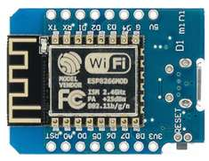
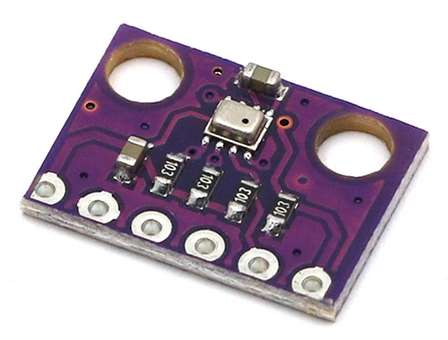
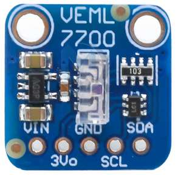
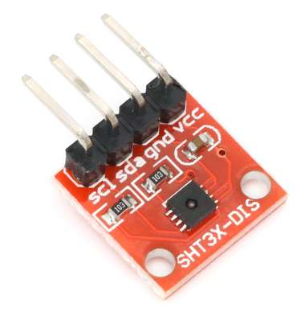
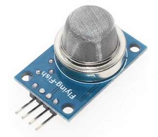

# WemosD1MiniSensorArray
Wemos D1 Mini, Sensors, REST API

# WiFi credentials
Make ```credentials.h``` in project folder:

```cpp
const char* ssid = "<SSID>";
const char* password = "<password>";
```

# REST API

## /temperature
```json
{
    "temp": "24.44",
    "unit": "°C"
}
```

## /pressure
```json
{
    "press": "1028.296",
    "unit": "hPa"
}
```

## /humidity
```json
{
    "humidity": "33.449",
    "unit": "rh"
}
```

## /lux
```json
{
    "lux": "9.310",
    "unit": "lx"
}
```

## /white
```json
{
    "white": "10.166",
    "unit": ""
}
```

## /als
```json
{
    "als": "1208.000",
    "unit": ""
}
```

## /gas
```json
{
    "gas": "0.907",
    "unit": "ppm"
}
```

## /all
```json
[
    {
        "temp": "24.50",
        "unit": "°C"
    },
    {
        "press": "1028.256",
        "unit": "hPa"
    },
    {
        "humidity": "33.149",
        "unit": "rh"
    },
    {
        "lux": "9.108",
        "unit": "lx"
    },
    {
        "white": "9.936",
        "unit": ""
    },
    {
        "als": "1265.000",
        "unit": ""
    },
    {
        "gas": "0.953",
        "unit": "ppm"
    }
]
```
# Components
## Wemos D1 Mini
https://www.aliexpress.com/item/32831353752.html



## Sensors
### BMP280
https://www.aliexpress.com/item/1005003185495795.html



### VEML 7700
https://www.aliexpress.com/item/1005003302988855.html



### SHT31
https://www.aliexpress.com/item/1005003327901391.html



### MQ-135
https://www.aliexpress.com/item/32547745710.html

